# 1. 사전 준비

이 단계에서는 실습에 필요한 로컬 도구, 계정, 클라우드 환경, 공용 데이터 파일을 확인합니다.

## 로컬 도구 확인

Windows에서 PowerShell을 열고 아래 명령을 차례로 실행합니다.

```powershell
node --version
npm --version
git --version
```

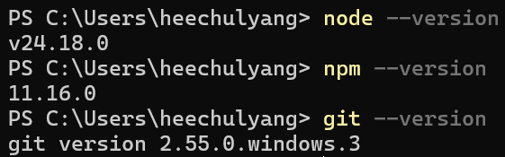

각 명령에 버전이 표시되는지 확인합니다. 명령을 찾을 수 없다면 아래에서 필요한 명령을 복사해 실행합니다.

**Node.js와 npm이 설치되지 않은 경우**

```powershell
winget install --id OpenJS.NodeJS.LTS -e --source winget
```

**Git이 설치되지 않은 경우**

```powershell
winget install --id Git.Git -e --source winget
```

설치가 끝나면 열려 있는 PowerShell을 모두 닫고 새 PowerShell을 엽니다. `node --version`, `npm --version`, `git --version`을 다시 실행해 각 버전이 표시되는지 확인합니다.

## Azure 및 Foundry 환경 확인

다음 항목이 준비되어 있어야 합니다.

- 교육용 Azure 계정
- 교육용 Azure 구독
- New Microsoft Foundry 프로젝트를 생성할 권한
- `gpt-5.4` 모델을 배포할 수 있는 구독과 지역
- File Search 파일 업로드 권한

Foundry 프로젝트 생성과 모델 배포는 다음 단계에서 직접 수행합니다.

File Search에 필요한 역할과 할당 범위는 아래 `File Search 필수 권한 추가`에서 확인합니다.

## Azure 계정 및 구독 배정

`hackathonsub01`은 진행자의 기능 테스트용 구독입니다.

참가자는 아래 표에서 본인에게 배정된 계정과 구독을 사용합니다. 각 계정에는 해당 구독의 `소유자` 권한이 할당되어 있습니다.

| 참가자 | Azure 구독 | 교육용 Azure 계정 | 구독 권한 |
|---|---|---|---|
| Jongsuk Oh | `hackathonsub02` | `testuser04@bnksyscokr.onmicrosoft.com` | 소유자 |
| Subok Kim | `hackathonsub02` | `testuser05@bnksyscokr.onmicrosoft.com` | 소유자 |
| Hyungu Lee | `hackathonsub02` | `testuser06@bnksyscokr.onmicrosoft.com` | 소유자 |
| Seokgyo Ko | `hackathonsub03` | `testuser07@bnksyscokr.onmicrosoft.com` | 소유자 |
| Seungtaek Oh | `hackathonsub03` | `testuser08@bnksyscokr.onmicrosoft.com` | 소유자 |
| Dongmin Park | `hackathonsub03` | `testuser09@bnksyscokr.onmicrosoft.com` | 소유자 |
| Jingyu Heo | `hackathonsub04` | `testuser10@bnksyscokr.onmicrosoft.com` | 소유자 |
| Haseok Jang | `hackathonsub04` | `testuser11@bnksyscokr.onmicrosoft.com` | 소유자 |
| 예비 계정 | `hackathonsub04` | `testuser12@bnksyscokr.onmicrosoft.com` | 소유자 |

### 초기 로그인 안내

1. 본인에게 배정된 계정과 구독을 확인합니다.
2. Microsoft 로그인 화면에 배정된 교육용 Azure 계정을 입력하고 `다음`을 클릭합니다.

	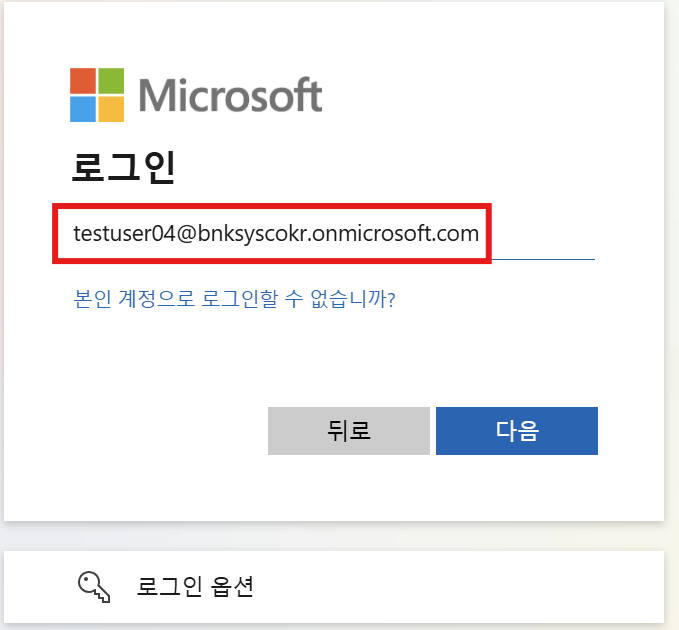

3. 현장에서 전달받은 초기 비밀번호를 입력하고 `로그인`을 클릭합니다.

	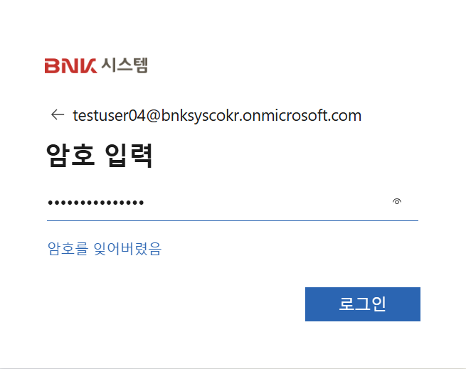

4. 초기 비밀번호는 이 저장소, AI 대화, 메모장, 소스 코드에 입력하거나 저장하지 않습니다.
5. 로그인 화면에서 비밀번호 변경을 요청하면 개인별 새 비밀번호로 변경합니다.
6. MFA 등록을 요청하면 화면 안내에 따라 전화번호 또는 Microsoft Authenticator를 등록합니다.

	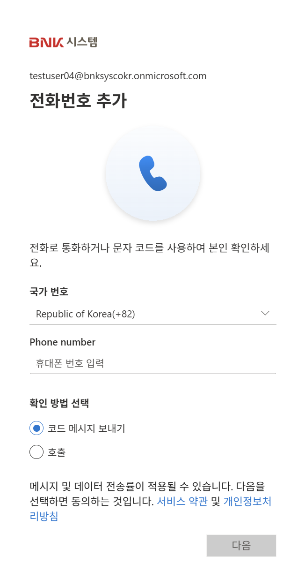

7. 실습이 끝날 때까지 변경한 비밀번호를 다른 참가자와 공유하지 않습니다.

### Azure Portal에서 배정 구독 확인

1. [Azure Portal](https://portal.azure.com)에 로그인합니다.
2. 상단 검색창에 `Subscriptions`를 입력하고 `Subscriptions` 서비스를 클릭합니다.

	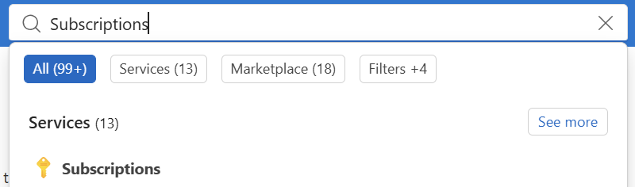

3. 본인에게 배정된 구독 이름과 `My role`의 `Owner` 표시를 확인합니다.

	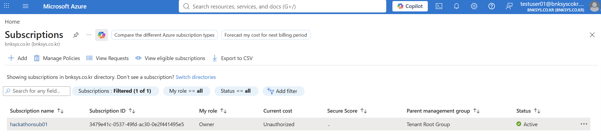

> 이미지의 `hackathonsub01`과 `testuser01`은 진행자 테스트 예시입니다. 참가자는 배정표에 있는 본인의 구독과 계정을 확인합니다.

## File Search 필수 권한 추가

공식 문서 기준으로 구독의 `Owner` 역할만으로는 Foundry Agent 생성과 File Search 파일 업로드를 수행할 수 없습니다. `Owner`는 Azure 리소스 관리와 역할 할당 권한을 제공하지만, Foundry 프로젝트의 데이터 작업과 Azure Blob 데이터 접근 권한은 제공하지 않습니다.

따라서 참가자 계정마다 다음 **두 역할**을 추가합니다. 두 기능을 모두 포함하는 단일 Azure 기본 제공 역할은 없습니다.

| 추가 역할 | 공식 최소 권한 범위 | 필요한 이유 | 역할 정의 ID |
|---|---|---|---|
| `Foundry Owner` | 참가자가 사용할 **Foundry 리소스** | Agent 리소스 생성, 수정, 테스트 등 Foundry 데이터 작업 | `c883944f-8b7b-4483-af10-35834be79c4a` |
| `Storage Blob Data Contributor` | 해당 프로젝트의 **Storage 계정** | File Search에 사용할 파일을 프로젝트 Storage에 업로드 | `ba92f5b4-2d11-453d-a403-e96b0029c9fe` |

이 워크숍에서는 참가자가 전용 구독 안에서 Foundry와 Storage 리소스를 새로 만들기 때문에, 리소스 생성 전에 **배정된 워크숍 구독 범위**에 두 역할을 사전 할당합니다. 구독에 할당된 역할은 이후 생성되는 하위 리소스에 상속됩니다.

> 구독 범위 할당은 공식 최소 권한 범위보다 넓습니다. 전용 워크숍 구독에서만 사용하고, 운영 환경에서는 위 표의 Foundry 리소스와 Storage 계정 범위로 제한합니다.

### Azure Portal에서 역할 할당

두 역할은 아래 공통 과정을 반복하여 할당합니다. 공통 IAM 화면과 구성원 선택 화면은 동일하므로 한 번만 안내합니다.

**공통 역할 할당 화면 열기**

1. Azure Portal의 `Subscriptions`에서 본인에게 배정된 구독을 클릭합니다.
2. 왼쪽 메뉴에서 `Access control (IAM)`을 클릭하고 `Role assignments` 탭을 선택합니다.

	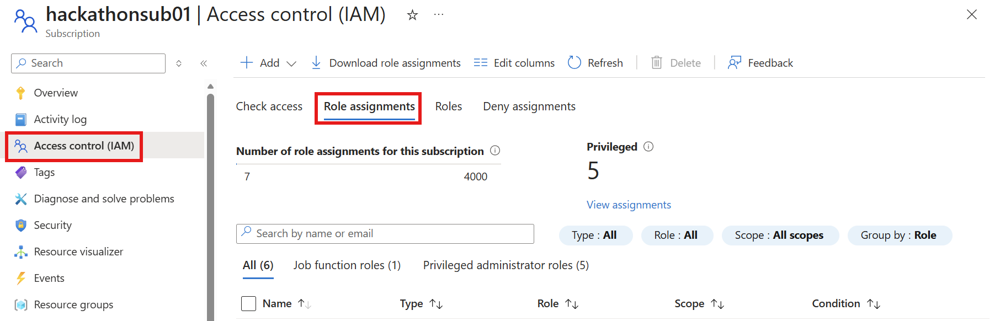

3. `Add` > `Add role assignment`를 클릭합니다.

	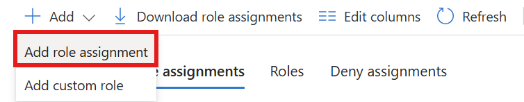

**Foundry Owner 할당**

1. 역할 검색창에 `Foundry`를 입력합니다.
2. 검색 결과에서 `Foundry Owner`를 선택하고 `Next`를 클릭합니다.

	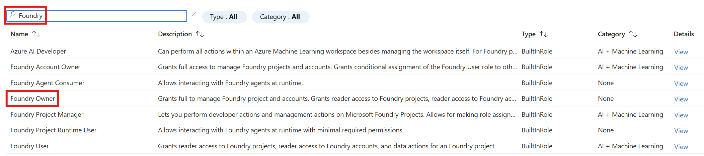

3. `Members` 탭에서 `User, group, or service principal`을 선택합니다.
4. `Select members`를 클릭하고 본인의 교육용 Azure 계정을 검색하여 선택합니다.

	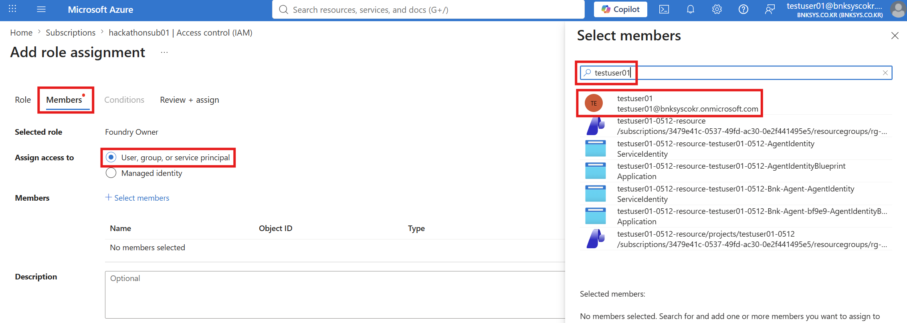

5. `Review + assign`을 클릭하여 할당을 완료합니다.

**Storage Blob Data Contributor 할당**

1. 위의 `공통 역할 할당 화면 열기` 과정을 다시 수행합니다.
2. 역할 검색창에 `Storage Blob`을 입력합니다.
3. 검색 결과에서 `Storage Blob Data Contributor`를 선택하고 `Next`를 클릭합니다.

	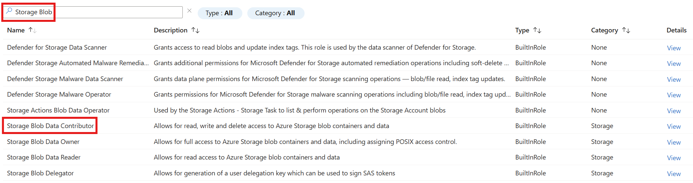

4. 위의 구성원 선택 화면과 동일하게 본인의 교육용 Azure 계정을 선택합니다.
5. `Review + assign`을 클릭하여 할당을 완료합니다.

### 역할 할당 확인

1. 구독의 `Access control (IAM)`에서 `Check access` 탭을 클릭합니다.
2. `View my access`를 클릭합니다.

	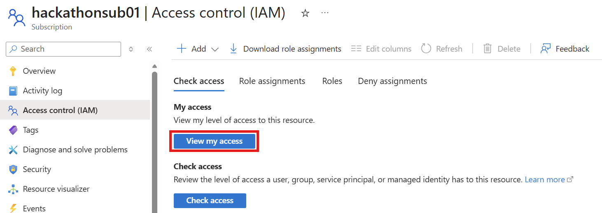

3. 현재 역할 목록에 `Owner`, `Foundry Owner`, `Storage Blob Data Contributor`가 표시되는지 확인합니다.

	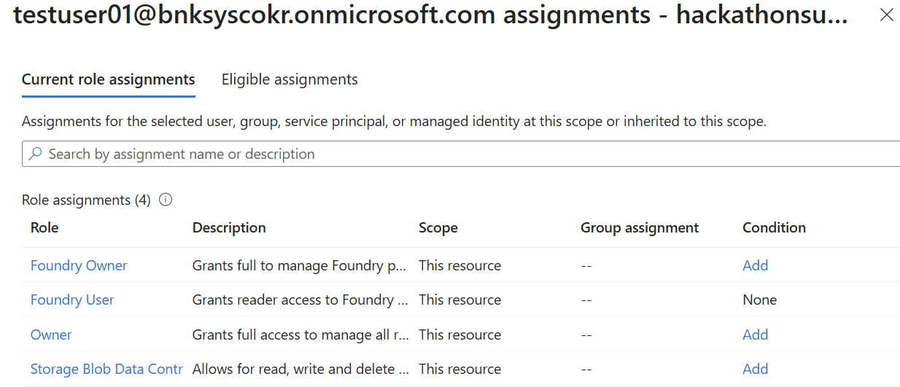

> 이미지의 구독과 사용자는 진행자 테스트 예시입니다.

역할 할당이 적용되기까지 지연될 수 있습니다. 할당 직후 파일 업로드에서 `403 Forbidden`이 발생하면 잠시 후 다시 로그인하여 확인합니다.

## 이름 규칙 확인

Agent 이름은 Foundry 프로젝트 안에서 Agent를 식별하는 이름이며 Azure 전체에서 고유할 필요는 없습니다. 참가자마다 별도의 `bnk-workshop-<alias>` 프로젝트를 사용하므로 두 Agent 이름은 모두 동일하게 사용합니다.

프로젝트, 지식 저장소, 로컬 폴더 이름에는 충돌을 피하도록 본인의 영문 alias를 붙입니다. 영문 alias는 소문자 영문과 숫자만 사용하고 공백, 한글, 특수문자는 제외합니다.

영문 alias가 `heechulyang`이라면 다음과 같이 사용합니다.

```text
bnk-workshop-heechulyang
fund-recommender
branch-opinion-writer
policy-funds-heechulyang
policy-fund-app-heechulyang
```

## 정책자금 데이터 준비

1. [2026년도 부산광역시 중소기업 자금지원계획 공고.pdf](../data/2026년도%20부산광역시%20중소기업%20자금지원계획%20공고.pdf)를 엽니다.
2. PDF가 정상적으로 열리고 내용을 조회할 수 있는지 확인합니다.
3. 파일을 로컬 컴퓨터에서 찾을 수 있는 위치에 준비합니다.

이 파일은 Foundry File Search에 업로드합니다. 4단계에서 만들 애플리케이션의 빈 폴더에는 미리 넣지 않습니다.

> 실습에서는 실제 고객 정보, 주민등록번호, 계좌번호, 암호를 입력하지 않습니다.

다음 단계: [2. Azure 구독 및 CLI 설정](../2.%20Azure%20구독%20및%20CLI%20설정/README.md)