# 2. Azure 구독 및 CLI 설정

이 단계에서는 Azure CLI를 설치하고 교육용 구독을 선택한 뒤, New Microsoft Foundry 프로젝트를 만들고 `gpt-5.4` 모델을 배포합니다.

## Azure CLI 설치

아래 명령을 실행합니다.

```powershell
winget install --exact --id Microsoft.AzureCLI
```

설치가 끝나면 다음과 같이 진행합니다.

1. 열려 있는 PowerShell 창을 모두 닫습니다.
2. 새 PowerShell을 엽니다.
3. 아래 명령을 실행합니다.

    ```powershell
    az version
    ```

    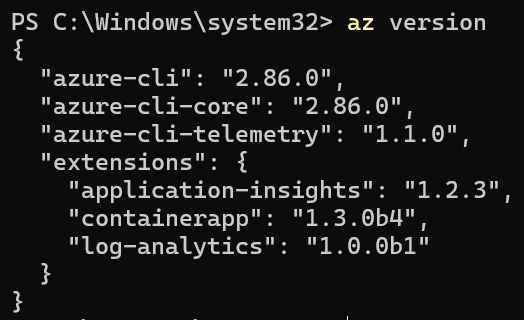

`winget`도 찾을 수 없다면 [Windows용 Azure CLI 공식 설치 페이지](https://learn.microsoft.com/cli/azure/install-azure-cli-windows)에서 64비트 MSI 설치 파일을 사용합니다.

## Azure 계정 로그인

1. PowerShell에서 아래 명령을 실행합니다.

    ```powershell
    az login
    ```

2. Windows 계정 선택 창이 열리면 배정된 계정을 선택합니다. 목록에 없다면 `회사 또는 학교 계정`을 선택하고 `계속`을 클릭합니다.

    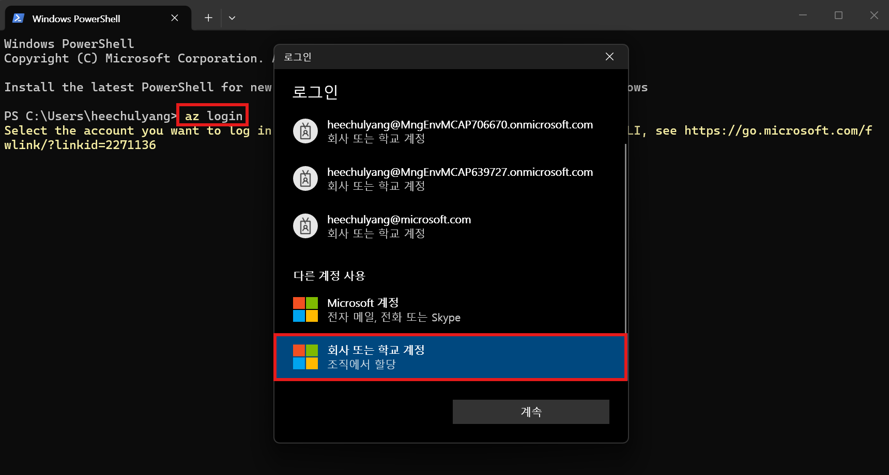

3. Microsoft Azure 로그인 화면이 열리면 본인에게 배정된 `testuser` 계정으로 로그인합니다.

    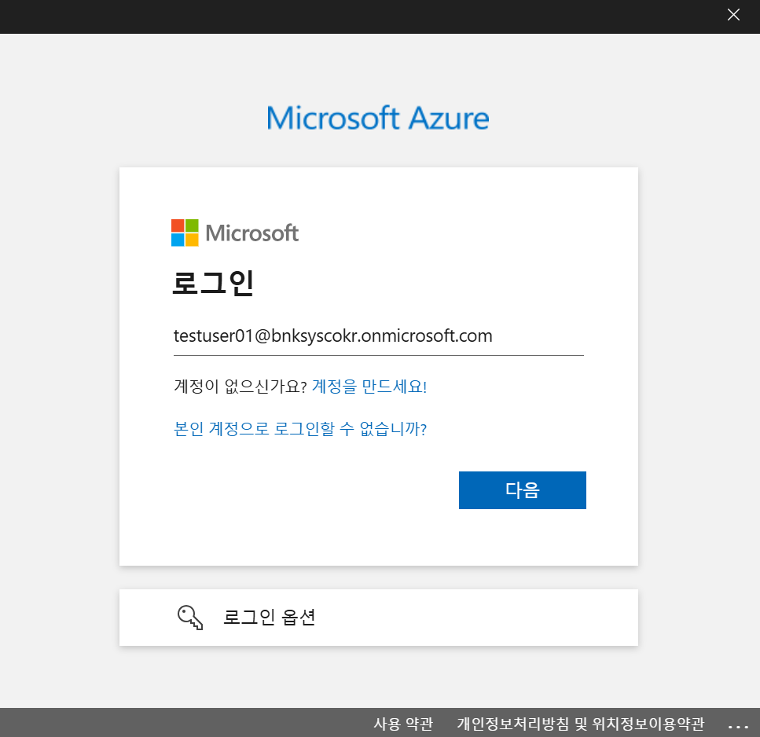

4. 인증이 끝나면 PowerShell에 구독 선택 목록이 표시됩니다.
5. 별표(`*`)가 붙은 기본 구독이 본인에게 배정된 `hackathonsub02`, `hackathonsub03`, `hackathonsub04` 중 하나인지 확인합니다.
6. `Select a subscription and tenant (Type a number or Enter for no changes):`가 표시되면 **아무 숫자도 입력하지 않고 Enter 키를 누릅니다.**

    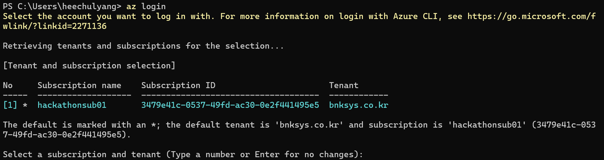

    > 여러 구독이 표시되고 별표가 붙은 구독이 본인의 배정 구독과 다르면, 배정 구독 앞의 번호를 입력하고 Enter 키를 누릅니다.

7. 현재 계정과 구독을 확인합니다.

    ```powershell
    az account show
    ```

    출력의 `name`에 본인의 배정 구독이, `user.name`에 본인의 교육용 계정이 표시되는지 확인합니다.

    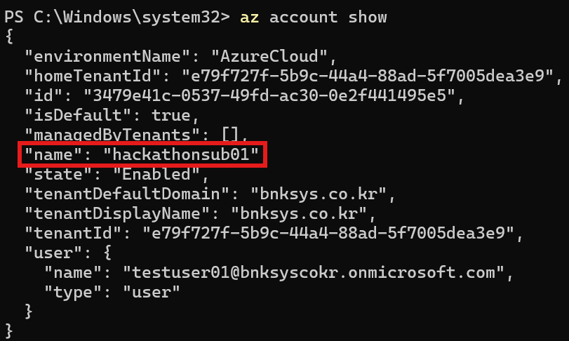

    > 이미지의 `hackathonsub01`과 `testuser01`은 진행자 테스트 예시입니다. 참가자는 본인에게 배정된 구독과 계정이 표시되어야 합니다.

## Microsoft Foundry 프로젝트 생성

### 프로젝트 만들기

1. 브라우저에서 [Microsoft Foundry](https://ai.azure.com)를 엽니다.
2. Azure CLI에서 사용한 교육용 계정으로 로그인합니다.
3. 오른쪽 위 `New Foundry` 토글이 켜져 있는지 확인합니다.
4. `Create project`를 클릭합니다.

    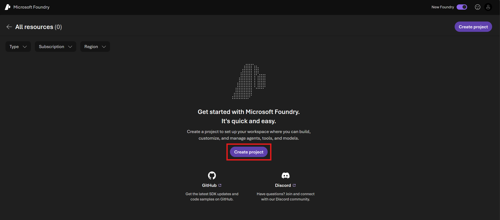

5. 프로젝트 생성 화면을 다음과 같이 설정합니다.

    - Project name: `bnk-workshop-<alias>`에서 `<alias>`를 본인의 영문 alias로 변경
    - Foundry resource: 자동 생성된 값 유지
    - Region: `East US 2`
    - Subscription: 본인에게 배정된 워크숍 구독
    - Resource group: 자동 생성된 새 리소스 그룹 유지
    - `Set up recommended resources so I can explore everything Foundry has to offer`: 켜기

    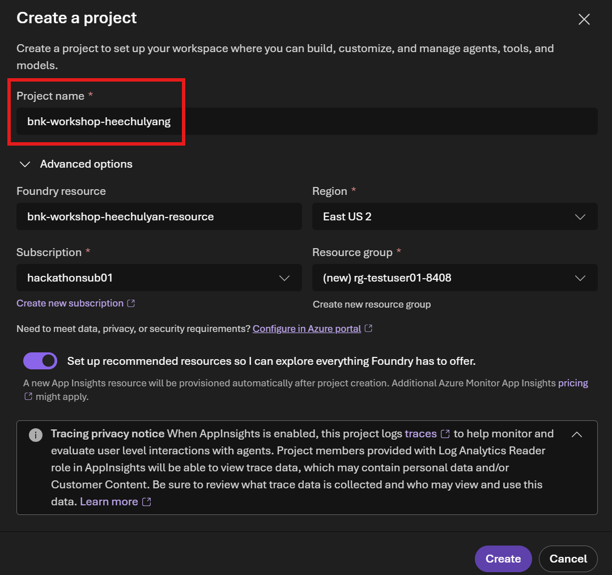

6. `Create`를 클릭하고 프로젝트 생성이 완료될 때까지 기다립니다.

### 프로젝트 Home 확인

프로젝트 생성이 끝나면 `Home` 화면이 열립니다.

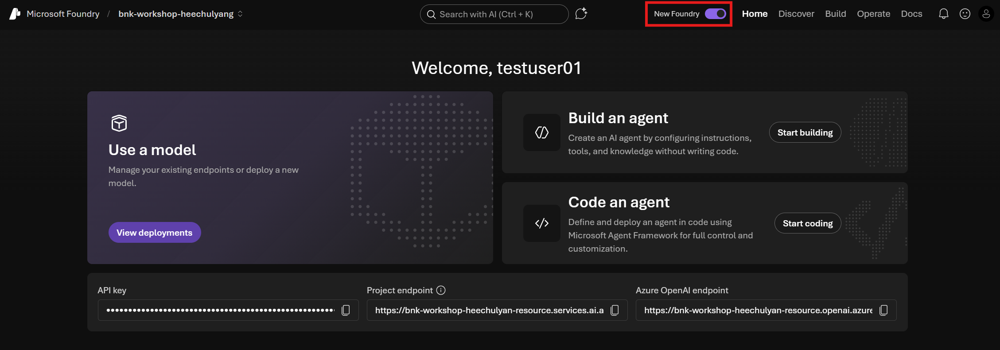

다음 항목을 확인합니다.

- 왼쪽 위 프로젝트 이름이 `bnk-workshop-<alias>`입니다.
- 오른쪽 위 `New Foundry` 토글이 켜져 있습니다.
- 화면 아래에 `Project endpoint`가 표시됩니다.

`Project endpoint`는 지금 복사하거나 별도로 기록하지 않습니다. 애플리케이션 연동에 필요할 때 이 `Home` 화면으로 돌아와 복사합니다.

> 이미지의 프로젝트명, 계정, 구독은 진행자 테스트 예시입니다. 참가자는 본인의 영문 alias와 배정 구독을 사용합니다.

## gpt-5.4 모델 배포

### 모델 선택

1. 상단 메뉴에서 `Discover`를 클릭합니다.
2. 왼쪽 메뉴에서 `Models`를 클릭합니다.
3. 검색창에 `gpt 5.4`를 입력합니다.
4. 검색 결과에서 `gpt-5.4`를 클릭합니다.

    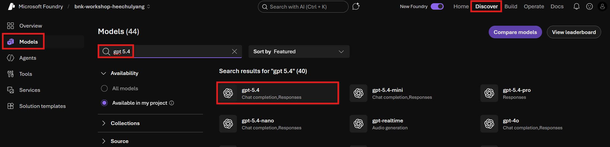

### 기본 설정으로 배포

1. 모델 상세 화면 오른쪽 위의 `Deploy`를 클릭합니다.
2. `Default settings`를 클릭합니다.

    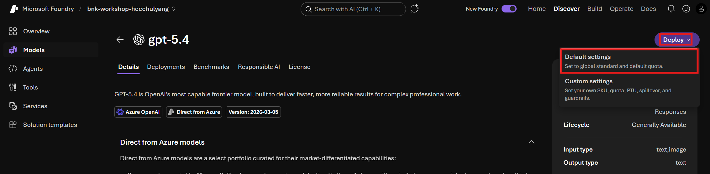

3. 배포가 완료될 때까지 기다립니다.
4. 배포 이름은 기본값인 `gpt-5.4`를 사용합니다.
5. 배포된 모델의 `Playground`가 열리면 채팅 입력창에 `안녕하세요`를 입력하고 전송합니다.
6. `gpt-5.4`가 정상적으로 응답하는지 확인합니다.

    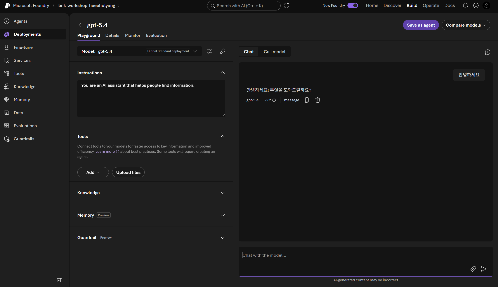

다음 단계: [3. Microsoft Foundry Agent 구성](../3.%20Microsoft%20Foundry%20Agent%20구성/README.md)