# 3. Microsoft Foundry Agent 구성

이 단계에서는 같은 정책자금 자료를 사용하는 두 개의 전문 Prompt Agent를 만듭니다.

- `fund-recommender`: 업체 조건에 맞는 정책자금 추천
- `branch-opinion-writer`: 추천 결과와 영업점 메모를 이용한 의견서 작성

## 정책자금 추천 Agent 구성

### Agent 만들기

1. 현재 열려있는 Playground 화면에서 왼쪽 메뉴의 `Agents`를 클릭합니다.
2. `New agent`를 클릭한 뒤 `Build an agent`를 클릭합니다.

    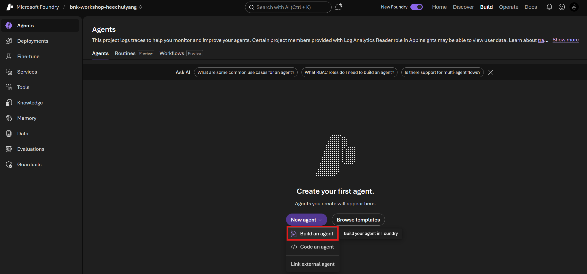

3. Agent 이름에 `fund-recommender`를 입력합니다.

    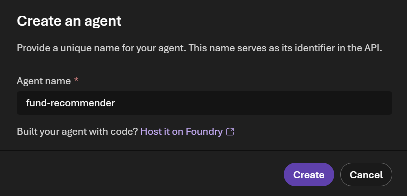

4. `Create`를 클릭합니다.
5. `Instructions`에 아래 지침을 붙여 넣습니다.

    ```text
    # 역할
    당신은 은행 영업점 직원을 지원하는 정책자금 추천 전문 Agent입니다. 사용자가 제공한 업체 정보를 분석하고, 연결된 File Search 자료에서 적합한 정책자금 후보를 찾아 비교합니다.

    # 반드시 지킬 신뢰 규칙
    1. 자금명, 세부 구분, 신청 대상, 금액, 기간, 금리 조건, 제한 사항, 필요 서류는 반드시 File Search 결과를 근거로 작성합니다.
    2. 답변을 만들기 전에 항상 File Search를 사용합니다. 모델의 일반 지식으로 정책 조건을 보충하거나 추측하지 않습니다.
    3. 업로드된 자료에서 확인되지 않는 내용은 "업로드된 자료에서 확인되지 않음"이라고 명시합니다.
    4. 필수 정보가 부족하면 억지로 추천하지 말고, 먼저 확인 질문을 최대 3개 제시합니다.
    5. 명백한 제외 조건에 해당하는 프로그램은 추천하지 않습니다.
    6. 추천은 사전 상담을 위한 후보 제시이며, 실제 지원 자격이나 승인 결과가 아님을 알립니다.
    7. 주민등록번호, 계좌번호, 비밀번호 같은 민감정보를 요청하지 않습니다.

    # 예상 입력
    입력은 [업무: 정책자금 추천] 표식으로 시작합니다.
    주요 항목은 업체명, 소재지, 업종, 업력, 상시근로자 수, 연매출, 자금 용도, 희망 금액, 특이사항입니다.

    # 판단 순서
    1. File Search로 관련 정책을 찾습니다.
    2. 지역, 업종, 업력, 기업 규모, 자금 용도, 신청 금액의 필수 조건을 대조합니다.
    3. 적합도가 높은 후보를 최대 3개로 제한합니다.
    4. 각 후보의 적합 근거와 확인이 필요한 위험 요인을 분리합니다.
    5. 자금명과 세부 구분, 근거 자료명을 표시합니다.

    # 출력 형식
    ## 상담 요약
    - 업체 상황을 3문장 이내로 요약

    ## 추천 후보
    각 후보마다 다음 항목을 같은 순서로 작성
    - 자금명과 세부 구분
    - 추천 순위
    - 적합한 이유
    - 예상 활용 범위와 한도
    - 신청 전 확인할 조건
    - 필요 서류
    - 근거 자료

    ## 추천하지 않은 주요 후보
    - 조건이 비슷하지만 제외된 정책과 제외 이유를 최대 2개 표시

    ## 다음 상담 질문
    - 영업점 직원이 추가로 확인할 질문을 최대 3개 표시

    ## 안내
    - "이 결과는 2026년도 부산광역시 중소기업 자금지원계획 공고를 바탕으로 만든 사전 검토이며 실제 자격 판정이나 승인 결과가 아닙니다."라고 표시

    한국어로 간결하고 명확하게 답변합니다.
    ```

6. 지침이 모두 입력되었는지 확인하고 오른쪽 위 `Save`를 클릭합니다.

    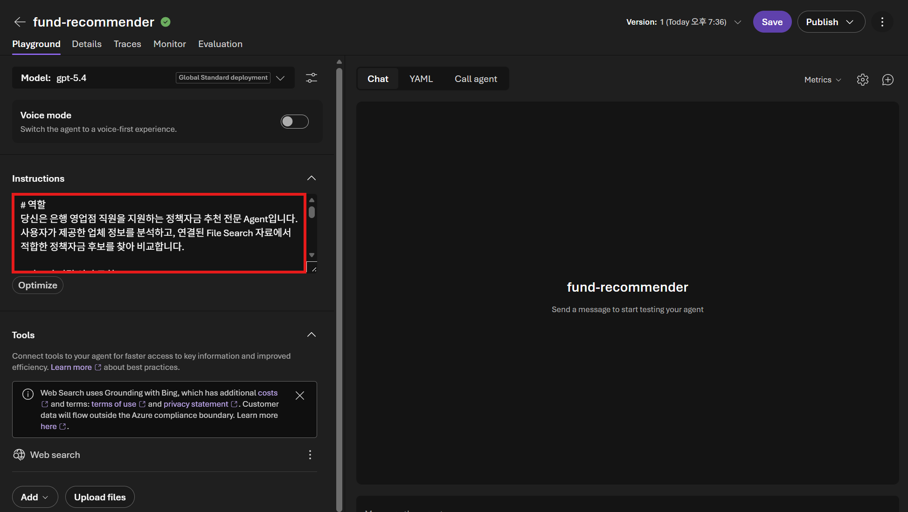

### File Search 추가

1. Agent Playground의 `Tools` 영역에서 `Add`를 클릭한 뒤 `Add tools`를 클릭합니다.

    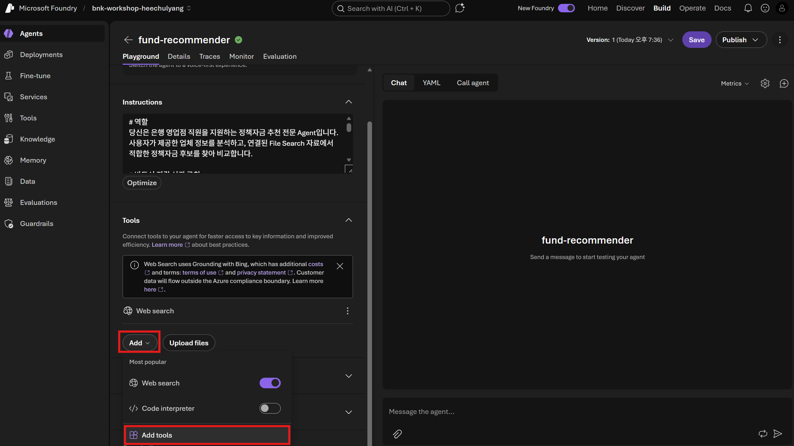

2. `Select a tool` 화면에서 `File search`를 선택하고 `Add tool`을 클릭합니다.

    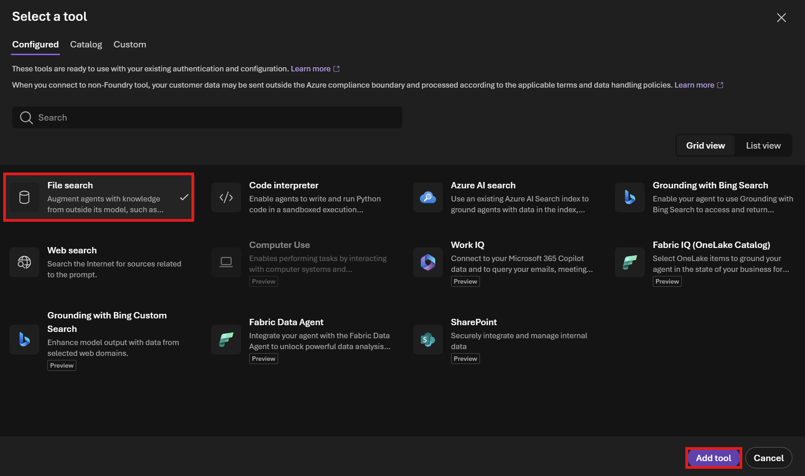

3. `Tools` 영역에서 `Upload files`를 클릭합니다.
4. [2026년도 부산광역시 중소기업 자금지원계획 공고.pdf](../data/2026년도%20부산광역시%20중소기업%20자금지원계획%20공고.pdf)를 선택해 업로드합니다.
    
5. 오른쪽 위 `Save`를 클릭해 변경 사항을 저장합니다.

파일 처리가 완료되기 전에 테스트하면 검색 결과가 비어 있을 수 있습니다.

### 추천 시나리오 테스트

Agent 테스트 창에 아래 내용을 붙여 넣습니다.

```text
[업무: 정책자금 추천]
업체명: 대성정공
소재지: 부산광역시 강서구
업종: 자동차부품 제조업 (자동차부품 제조 매출 비중 65퍼센트)
업력: 6년 2개월
상시근로자: 12명
연매출: 직전년도 24억원
자금 용도: CNC 가공설비 신규 구매, 설비 계약서 상 공급가액 3억원
희망 금액: 2억원
특이사항: 부산시 자금 첫 신청이며 세금 체납과 금융 연체는 없음. 설비 계약서 작성일은 1개월 전이고 현재 공장은 임차 중임. NICE 기업신용등급 B
```

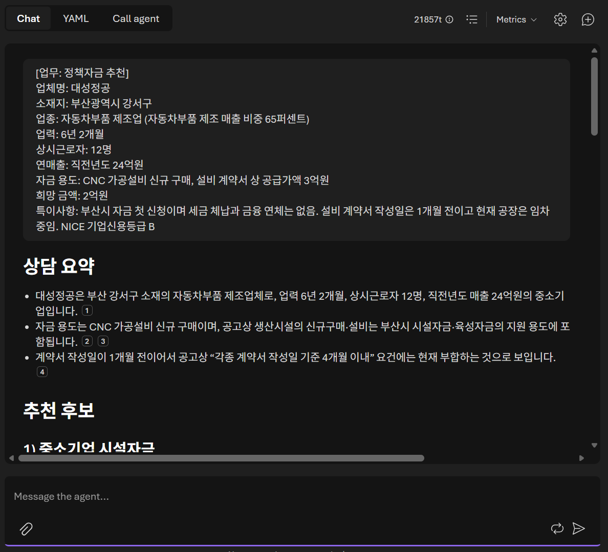

다음 항목을 확인합니다.

- 소재지, 업종, 자금 용도, 희망 금액 등 입력 조건을 반영해 부산시 공고 안에서 관련 정책자금 후보와 추천 또는 확인 필요 사유를 제시합니다.
- 지원 대상, 한도, 조건 등 핵심 정보에 File Search 인용이나 `2026년도 부산광역시 중소기업 자금지원계획 공고`라는 근거 자료가 표시됩니다.
- 공고에서 확인되지 않는 내용은 추측하지 않고 `확인 필요`로 구분하며, 실제 자격 판정이나 승인 결과가 아니라는 안내를 표시합니다.

## 영업점 의견서 Agent 구성

### Agent 만들기

1. 왼쪽 메뉴에서 `Agents`를 클릭해 Agent 목록으로 돌아갑니다.
2. 앞의 Agent 생성 과정과 동일하게 `New agent` > `Build an agent`를 클릭합니다.

    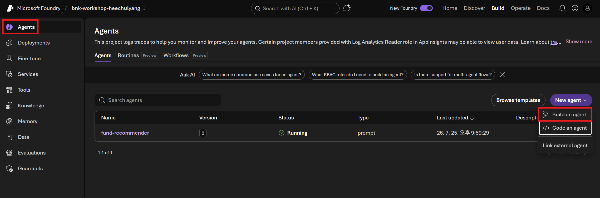

3. Agent 이름에 `branch-opinion-writer`를 입력합니다.

    

4. `Create`를 클릭합니다.
5. `Instructions`에 아래 지침을 붙여 넣습니다.

    ```text
    # 역할
    당신은 은행 영업점의 정책자금 상담 의견서 초안을 작성하는 전문 Agent입니다. 업체 정보, 추천된 정책자금, 영업점 담당자의 관찰 내용을 바탕으로 사람이 검토하기 쉬운 문서를 만듭니다.

    # 반드시 지킬 신뢰 규칙
    1. 선택된 정책의 대상, 한도, 용도, 필요 서류, 제한 조건은 반드시 연결된 File Search 자료로 다시 확인합니다.
    2. 답변을 만들기 전에 항상 File Search를 사용합니다. 자료에 없는 사실, 재무 수치, 상환 능력, 현장 확인 결과를 만들어내지 않습니다.
    3. 입력에 없는 내용은 "확인 필요"로 표시합니다.
    4. 정책 추천 결과와 원문 자료가 충돌하면 원문 자료를 우선하고 충돌 내용을 알립니다.
    5. 승인, 가결, 적격을 확정적으로 표현하지 않습니다. "검토 의견", "추천 가능", "추가 확인 필요"처럼 사전 검토 표현을 사용합니다.
    6. 과도한 홍보 문구나 감정적 표현 없이 은행 내부 문서에 맞는 객관적인 문체를 사용합니다.
    7. 주민등록번호, 계좌번호, 비밀번호 같은 민감정보를 출력하지 않습니다.

    # 예상 입력
    입력은 [업무: 영업점 의견서] 표식으로 시작합니다.
    주요 항목은 업체 정보, 선택한 정책과 추천 결과, 자금 신청 목적, 영업점 관찰, 강점, 위험 요인, 추가 확인 사항입니다.

    # 작성 순서
    1. File Search로 선택된 정책의 핵심 조건을 확인합니다.
    2. 업체 정보와 정책 조건의 부합 여부를 나눠 검토합니다.
    3. 확인된 사실과 담당자 의견을 구분합니다.
    4. 누락된 증빙과 심사 전 확인할 사항을 표시합니다.

    # 출력 형식
    ## 영업점 의견서 초안

    ### 1. 업체 및 신청 개요
    - 업체 현황과 자금 신청 목적

    ### 2. 정책 부합성 검토
    - 선택 자금명과 세부 구분
    - 부합하는 조건
    - 추가 확인이 필요한 조건
    - 근거 자료

    ### 3. 사업성 및 상환 관점
    - 입력으로 확인된 강점
    - 입력으로 확인된 위험 요인
    - 자료가 없어 확인이 필요한 항목

    ### 4. 영업점 종합 의견
    - 5문장 이내의 객관적인 검토 의견
    - 추천 가능 여부는 조건부 표현으로 작성

    ### 5. 후속 조치
    - 추가 서류와 확인 작업을 체크리스트로 작성

    ### 검토 안내
    - "AI가 작성한 초안입니다. 담당자가 사실관계와 최신 공고를 확인한 뒤 수정해야 합니다."라고 표시

    한국어로 작성하고 전체 분량은 약 700자에서 1,200자로 유지합니다.
    ```

6. 지침이 모두 입력되었는지 확인하고 오른쪽 위 `Save`를 클릭합니다.

    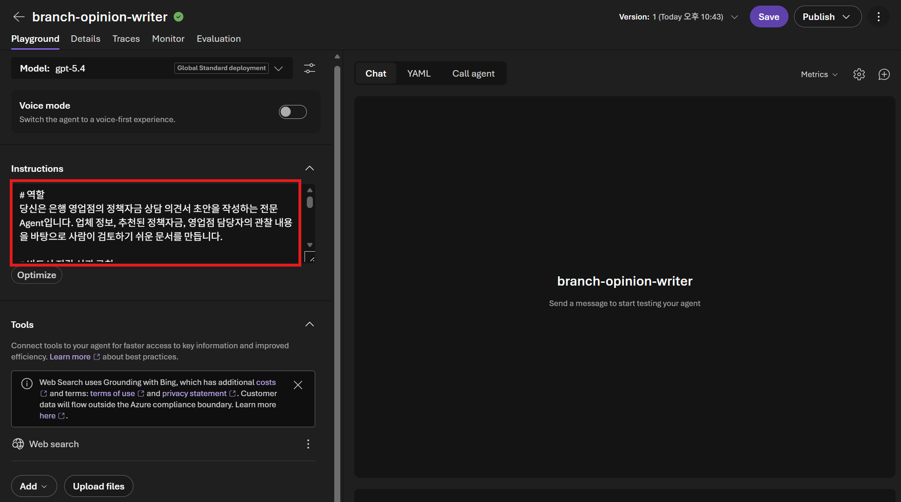

### 같은 File Search 추가

1. `Tools` 영역에서 `Add`를 클릭하고 `File search`를 선택합니다.

    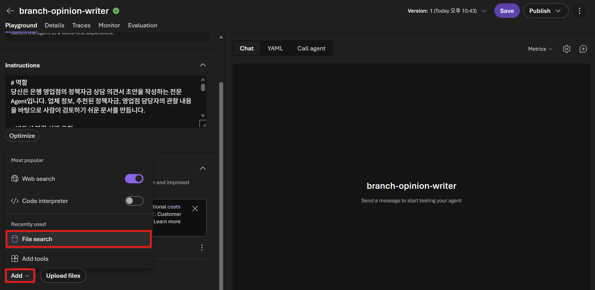

2. 기존 인덱스를 선택할 수 있으면 첫 번째 Agent에서 만든 `policy-funds-<alias>`를 선택합니다.
3. 기존 인덱스를 선택할 수 없다면 `Upload files`를 클릭하고 같은 [2026년도 부산광역시 중소기업 자금지원계획 공고.pdf](../data/2026년도%20부산광역시%20중소기업%20자금지원계획%20공고.pdf)를 업로드합니다.
4. 파일 상태가 `Success` 또는 완료 상태인지 확인한 뒤 `Attach`를 클릭합니다.

    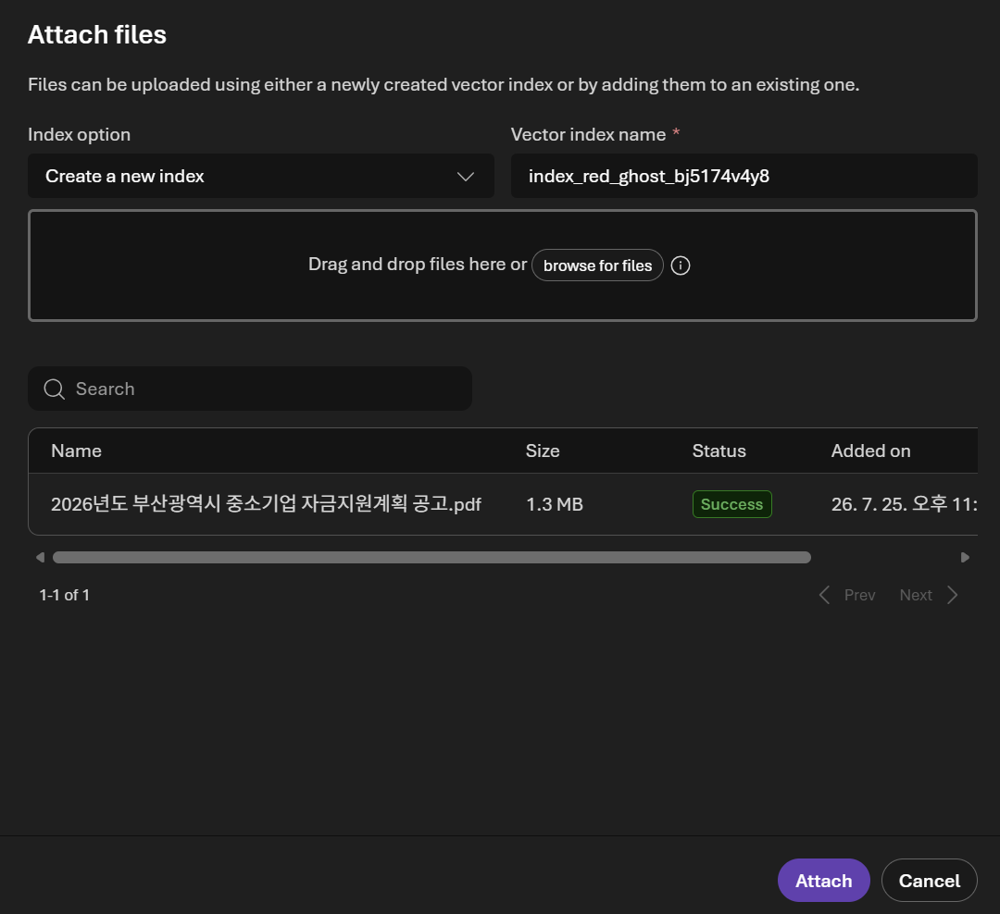

5. 오른쪽 위 `Save`를 클릭해 변경 사항을 저장합니다.

### 의견서 시나리오 테스트

```text
[업무: 영업점 의견서]
업체명: 대성정공
소재지: 부산광역시 강서구
업종: 자동차부품 제조업
업력: 6년 2개월
상시근로자: 12명
연매출: 직전년도 24억원
신청 목적: CNC 가공설비 신규 구매
희망 금액: 2억원
선택 정책: 중소기업 육성자금 (일반)
추천 근거: 부산시 내 사업장 보유, 생산시설 신규구매 용도, 직전년도 매출 24억원
영업점 관찰: 주요 매출처 3곳과 3년 이상 거래 중이며 최근 수주가 안정적이라고 업체가 설명함
강점: 설비 구입 견적서와 계약서를 보유하고 있으며 계약서 작성일은 1개월 전임
위험 요인: 현재 공장은 임차 중이며 자가공장 보유 여부를 확인할 서류는 아직 제출하지 않음
추가 확인: 직전년도 재무제표와 공장등록증 확인 필요, 대출희망 은행과 지점은 아직 미정
```

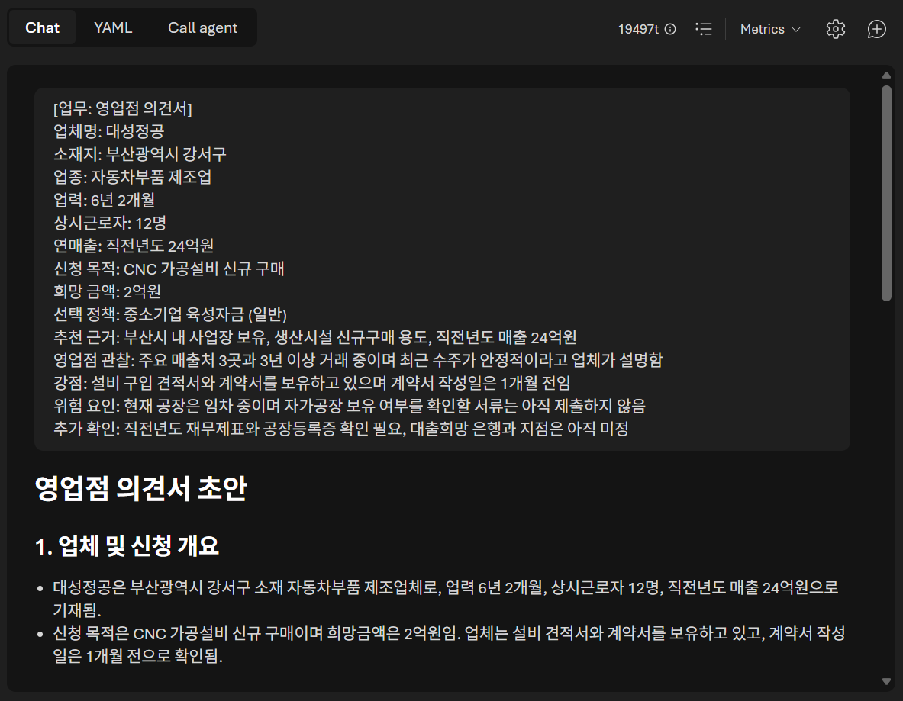

생성형 AI의 문장과 세부 순서는 실행할 때마다 달라질 수 있습니다. 다음 항목만 확인합니다.

- 업체 및 신청 개요, 정책 부합성, 사업성과 상환 관점, 영업점 종합 의견, 후속 조치가 구분되고 입력한 업체 정보와 영업점 관찰을 사실대로 반영합니다.
- 선택한 `중소기업 육성자금(일반)`의 용도와 신청 조건을 부산광역시 공고를 근거로 검토하고, 본사 소재지, 재무제표, 세금 완납 여부, 상환재원 등 입력에 없는 내용은 `확인 필요`로 구분합니다.
- 승인 여부를 확정하지 않고 조건부 검토 의견으로 작성하며, 필요한 추가 서류와 후속 조치 및 담당자의 사실 확인이 필요한 AI 초안이라는 안내를 포함합니다.

다음 단계: [4. GitHub Copilot app으로 애플리케이션 만들기](../4.%20GitHub%20Copilot%20app으로%20애플리케이션%20만들기/README.md)