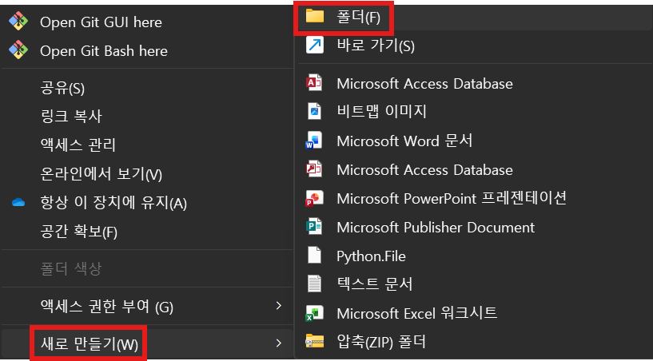

# 4. GitHub Copilot app으로 애플리케이션 만들기

이 단계에서는 완전히 빈 로컬 폴더에서 웹 애플리케이션을 만들고 앞 단계의 두 Foundry Agent를 연결합니다.

## 빈 로컬 폴더 연결

1. Windows 파일 탐색기에서 문서 폴더를 엽니다.
2. `policy-fund-app-<alias>`라는 새 폴더를 만들고 `<alias>`를 본인의 영문 alias로 바꿉니다.

  

3. 폴더 안이 비어 있는지 확인합니다.
4. GitHub Copilot app을 실행합니다.
5. GitHub 계정으로 로그인되어 있는지 확인합니다.
6. 왼쪽 `Sessions` 옆의 `+` 버튼을 클릭합니다.
7. `Local folder or repository`를 선택합니다.
8. 방금 만든 빈 폴더를 연결합니다.
9. 새 세션의 실행 위치는 `local repository` 또는 현재 로컬 폴더를 선택합니다.
10. 새 working tree나 cloud sandbox는 선택하지 않습니다.
11. 세션 모드는 `Interactive`, 모델은 `Auto`를 선택합니다.

## 화면과 모의 업무 흐름 만들기

아래 프롬프트를 한 번에 붙여 넣습니다.

```text
현재 연결된 폴더는 비어 있습니다. 이 폴더에서 처음부터 작동하는 웹 앱을 만들어 주세요.

앱 목적:
- 은행 영업점 직원이 업체 정보를 입력해 정책자금 추천을 받고 영업점 의견서 초안을 만드는 내부 업무 도구

기술 조건:
- Node.js 20 이상, JavaScript ESM, Express 사용
- 프런트엔드는 별도 빌드 도구 없이 바닐라 HTML, CSS, JavaScript 사용
- package.json에 start와 dev 스크립트 추가
- public 폴더의 정적 화면과 Express 서버로 구성
- GET /api/health와 POST /api/agent API 제공
- 지금 단계의 POST /api/agent는 모의 응답을 반환하고, 다음 단계에서 Foundry로 교체할 수 있게 함수로 분리
- .gitignore, .env.example, README.md 작성
- 비밀정보나 API 키를 코드에 넣지 않기

화면 조건:
- 상단에 "정책자금 상담 도우미" 제목과 연결 상태 표시
- "정책자금 추천"과 "영업점 의견서" 두 개의 탭
- 추천 탭 입력: 업체명, 소재지, 업종, 업력, 상시근로자, 연매출, 자금 용도, 희망 금액, 특이사항
- 의견서 탭 입력: 업체 정보, 선택 정책, 추천 근거, 영업점 관찰, 강점, 위험 요인, 추가 확인
- 추천 결과에 "이 추천으로 의견서 작성" 버튼을 두고 누르면 관련 내용이 의견서 탭으로 전달되게 구현
- 생성 중 상태, 오류 상태, 다시 시도 기능 제공
- 실제 승인 결과가 아니라는 안내를 항상 표시
- 데스크톱과 모바일에서 글자가 겹치지 않는 차분한 은행 내부 업무 도구 디자인
- 과도한 장식, 그라데이션, 중첩 카드는 사용하지 않기

작업 방법:
1. 필요한 파일을 생성하세요.
2. npm 패키지를 설치하세요.
3. 최소한의 API 동작 확인을 수행하세요.
4. 앱을 포트 3000에서 실행하세요.
5. 브라우저에서 확인할 수 있는 주소를 알려주세요.
```

Copilot이 파일 생성이나 명령 실행을 요청하면 내용을 확인하고 `Allow` 또는 승인 버튼을 클릭합니다. 작업이 끝나면 `Changes`에서 생성된 파일 목록을 확인합니다.

브라우저에서 `http://localhost:3000`을 열고 다음을 확인합니다.

- 두 개의 업무 탭이 표시됩니다.
- 추천 버튼을 클릭하면 모의 추천 결과가 나옵니다.
- 추천 결과를 의견서 탭으로 넘길 수 있습니다.

## 두 Foundry Agent 연결

### 필요한 연결 값 가져오기

연동 프롬프트를 입력하기 직전에 Foundry에서 현재 값을 가져옵니다.

1. 브라우저에서 [Microsoft Foundry](https://ai.azure.com)를 열고 `bnk-workshop-<alias>` 프로젝트를 선택합니다.
2. 상단 `Home`을 클릭합니다.
3. 화면 아래 `Project endpoint` 옆의 복사 버튼을 클릭합니다.

    

4. `API key`와 `Azure OpenAI endpoint`는 복사하지 않습니다.
5. 상단 `Build` > 왼쪽 `Agents`로 이동해 앞 단계에서 만든 다음 두 Agent 이름을 확인합니다.

    - `fund-recommender-<alias>`
    - `branch-opinion-writer-<alias>`

6. 방금 확인한 값을 아래 프롬프트의 세 줄에 직접 붙여 넣습니다. 별도 메모장 파일로 저장하지 않습니다.

프로젝트 엔드포인트와 Agent 이름은 암호나 API 키가 아닙니다. 프로젝트 엔드포인트 끝에 `/openai/v1`이나 `/responses`를 추가하지 않습니다.

```text
현재 앱의 모의 응답을 Microsoft Foundry의 두 Prompt Agent 호출로 교체해 주세요.

연결 값:
PROJECT_ENDPOINT=여기에 Foundry 프로젝트 엔드포인트
RECOMMENDER_AGENT=여기에 추천 Agent 이름
OPINION_AGENT=여기에 의견서 Agent 이름

구현 조건:
- 최신 @azure/ai-projects와 @azure/identity, dotenv 패키지 사용
- AzureCliCredential 또는 DefaultAzureCredential로 현재 az login 사용자의 Microsoft Entra 인증 사용
- API 키 인증은 추가하지 않기
- PROJECT_ENDPOINT, RECOMMENDER_AGENT, OPINION_AGENT는 서버의 .env에서만 읽기
- 실제 값을 넣은 .env를 만들고, 자리표시자만 있는 .env.example도 유지
- .env가 .gitignore에 포함되어 있는지 확인
- 브라우저로 Azure 설정값이나 액세스 토큰을 보내지 않기

Foundry 호출 방식:
- AIProjectClient(PROJECT_ENDPOINT, credential)를 서버에서 한 번 생성
- getOpenAIClient()로 OpenAI 호환 클라이언트 생성
- 요청의 workflow가 recommend이면 RECOMMENDER_AGENT를 선택
- 요청의 workflow가 opinion이면 OPINION_AGENT를 선택
- openai.responses.create의 첫 번째 인수에는 input을 넣기
- 두 번째 인수의 body에는 다음 형태의 agent_reference를 넣기
  { agent_reference: { type: "agent_reference", name: 선택한Agent이름 } }
- 응답은 output_text를 우선 사용하고, 없으면 output 배열의 text를 안전하게 합치기
- Agent나 대화 객체를 앱에서 새로 만들지 말고 Foundry에 저장된 Prompt Agent를 호출하기

업무 요청 구성:
- recommend 요청은 [업무: 정책자금 추천]으로 시작하고 화면의 모든 업체 필드를 읽기 쉬운 한국어 텍스트로 전달
- opinion 요청은 [업무: 영업점 의견서]로 시작하고 업체 필드, 선택 정책, 추천 결과, 영업점 메모를 함께 전달
- 빈 필드와 잘못된 workflow를 서버에서 검증
- Azure 오류의 전체 내부 정보나 토큰은 브라우저에 노출하지 않기
- 401은 Azure 로그인 확인, 403은 권한 확인, 404는 endpoint와 Agent 이름 확인이라는 한국어 안내로 변환

검증:
1. 의존성을 설치하세요.
2. GET /api/health가 두 Agent 이름의 설정 여부를 true로 반환하는지 확인하세요. 실제 값은 반환하지 마세요.
3. 서버를 다시 시작하세요.
4. 가능하면 추천 요청 하나를 실행해 실제 Foundry 응답을 확인하세요.
5. 변경 파일과 실행 결과를 짧게 설명하세요.
```

Copilot이 작업을 마치면 브라우저를 새로고침합니다.

- 화면의 연결 상태가 정상으로 바뀌는지 확인합니다.
- 모의 응답 문구가 더 이상 나오지 않는지 확인합니다.
- Foundry에서 테스트한 것과 같은 형식의 결과가 나오는지 확인합니다.

다음 단계: [5. 결과 확인](../5.%20결과%20확인/README.md)