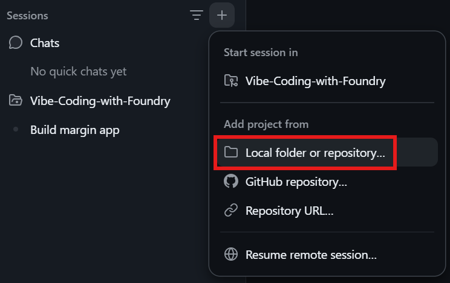
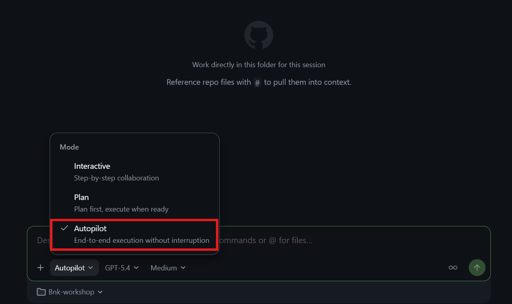
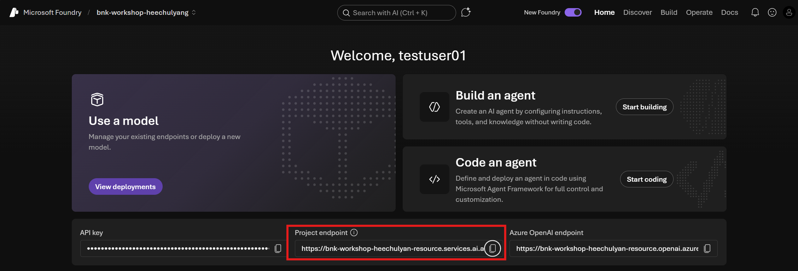

# 4. GitHub Copilot app으로 애플리케이션 만들기

이 단계에서는 완전히 빈 로컬 폴더에서 웹 애플리케이션을 만들고 앞 단계의 두 Foundry Agent를 연결합니다.

## GitHub Copilot app 확인

1. GitHub Copilot app을 실행합니다.
2. 워크숍에서 사용할 GitHub 계정으로 로그인합니다.
3. 왼쪽에 `Sessions` 메뉴와 `+` 버튼이 표시되는지 확인합니다.

## 빈 로컬 폴더와 Agent 세션 만들기

1. GitHub Copilot app의 왼쪽 `Sessions` 옆에 있는 `+` 버튼을 클릭합니다.
2. `Local folder or repository`를 선택합니다.

    

3. Windows 폴더 선택기가 열리면 `문서` 폴더로 이동합니다.
4. 폴더 선택기에서 `새 폴더`를 클릭합니다.
5. 폴더 이름을 `policy-fund-app-<alias>`로 입력하고 `<alias>`를 본인의 영문 alias로 바꿉니다.

    

6. 방금 만든 빈 폴더를 선택하고 `폴더 선택`을 클릭합니다.
7. 새 세션이 현재 로컬 폴더에서 직접 작업하는지 확인합니다.
8. 세션 모드는 `Autopilot`, 모델은 `GPT-5.4`, 추론 수준은 `Medium`을 선택합니다.

    

## 화면과 모의 업무 흐름 만들기

아래 프롬프트를 한 번에 붙여 넣습니다.

```text
현재 연결된 폴더는 비어 있습니다. 이 폴더에서 처음부터 작동하는 웹 앱을 만들어 주세요.

앱 목적:
- 은행 영업점 직원이 업체 정보를 입력해 정책자금 추천을 받고 영업점 의견서 초안을 만드는 내부 업무 도구

기술 조건:
- Node.js 20 이상, JavaScript ESM, Express 사용
- 프런트엔드는 별도 빌드 도구 없이 바닐라 HTML, CSS, JavaScript 사용
- package.json에 start와 dev 스크립트 추가
- public 폴더의 정적 화면과 Express 서버로 구성
- GET /api/health와 POST /api/agent API 제공
- 지금 단계의 POST /api/agent는 모의 응답을 반환하고, 다음 단계에서 Foundry로 교체할 수 있게 함수로 분리
- 비밀정보나 API 키를 코드에 넣지 않기
- Agent의 Markdown 응답은 marked로 파싱하고 DOMPurify로 정제해 제목, 목록, 표, 굵은 글씨, 링크를 안전하게 렌더링

화면 조건:
- 상단에 "정책자금 상담 도우미" 제목과 연결 상태 표시
- "정책자금 추천"과 "영업점 의견서" 두 개의 탭
- 추천 탭 입력: 업체명, 소재지, 업종, 업력, 상시근로자, 연매출, 자금 용도, 희망 금액, 특이사항
- 추천 탭에 "예시 불러오기" 버튼을 두고 부산 강서구, 자동차부품 제조 매출 65%, 업력 6년 2개월, 12명, 매출 24억원, CNC 설비 공급가 3억원, 희망 2억원, 첫 신청, 체납 및 연체 없음, 계약 1개월 전, 임차공장, NICE B를 자동 입력
- 의견서 탭 입력: 업체 정보, 선택 정책, 추천 근거, 영업점 관찰, 강점, 위험 요인, 추가 확인
- 추천 결과에 "이 추천으로 의견서 작성" 버튼을 두고 누르면 관련 내용이 의견서 탭으로 전달되게 구현
- 의견서 결과는 제목, 업체 및 신청 개요, 정책 부합성, 사업성과 위험, 종합 의견, 후속 조치가 구획된 A4 표형 서식으로 렌더링
- AI 결과 생성 중에는 `생성 중` 문구와 점 3개가 순서대로 나타났다 사라지는 가벼운 CSS 애니메이션을 표시하고 요청 완료 후 숨김. 화면 읽기 도구용 상태 문구, 오류 상태와 다시 시도 기능 제공
- 실제 승인 결과가 아니라는 안내를 항상 표시
- 데스크톱은 높이 68px 차콜 헤더, 너비 238px 좌측 업무 레일, 나머지 흰색 작업영역의 풀 높이 셸로 구성하고 모바일에서는 레일을 상단 업무 선택기로 전환
- 헤더는 배경 `#202522`와 하단 2px BNK Red 선을 사용하고, 왼쪽에 붉은 정사각 심볼, 굵은 제품명과 짧은 설명, 오른쪽에 외곽선 상태 배지를 배치
- 좌측 레일은 `#F6F7F5` 배경에 정책자금 추천과 영업점 의견서 메뉴를 세로 배치하고, 선택 항목은 흰 배경, 왼쪽 4px BNK Red 선, 붉은 번호 사각형으로 표시
- 메인 상단은 아이콘 타일, 붉은 눈썹 문구, 28~34px 제목, 우측 주요 CTA로 구성하고 그 아래 업체정보, AI 추천, 의견서의 가로 단계 스트립과 얇은 선 기반 4열 요약 KPI를 배치
- 본문과 결과는 중앙의 둥근 대형 카드 한 장으로 감싸지 말고 전체 폭 패널, 1px 구분선, 20~28px 여백으로 구성. 반복 결과만 반경 5px 이하의 카드로 만들고 그림자는 없거나 매우 약하게 사용
- 글꼴은 `IBM Plex Sans KR`, `Noto Sans KR`, `Malgun Gothic`, sans-serif 순서로 사용하고 레이블 12px, 본문 14~16px, 제목 28~34px, 굵기 700~800, letter-spacing 0 적용
- BNK Red `#D7191F`는 활성 상태와 CTA, BNK Dark Red `#8B0304`는 hover와 focus, 차콜 `#202522`는 헤더와 주요 글자, `#5D655F`는 보조 글자, `#F2F4F1`은 캔버스, `#DCE1DC`는 구분선에 사용
- 성공 상태는 절제된 초록 `#13795B`, BNK Gold `#896E4A`와 BNK Silver `#909394`는 상태, 구분선, 보조 아이콘에만 제한하고 그라데이션, 큰 그림자, 과도한 둥근 모서리와 중첩 카드는 사용하지 않기

작업 방법:
1. 필요한 파일을 생성하세요.
2. npm 패키지를 설치하세요.
3. 최소한의 API 동작 확인을 수행하세요.
4. 앱을 실행하세요.
5. 브라우저에서 확인할 수 있는 주소를 알려주세요.
```

Copilot이 파일 생성이나 명령 실행을 요청하면 내용을 확인하고 `Allow` 또는 승인 버튼을 클릭합니다. 작업이 끝나면 `Changes`에서 생성된 파일 목록을 확인합니다.

브라우저에서 출력된 링크를 열고 다음을 확인합니다.

- 두 개의 업무 탭이 표시됩니다.
- `예시 불러오기` 버튼이 추천 입력값을 자동으로 채웁니다.
- 모의 Markdown 응답의 제목과 목록이 서식에 맞게 표시됩니다.
- 추천 버튼을 클릭하면 모의 추천 결과가 나옵니다.
- 추천 결과를 의견서 탭으로 넘길 수 있습니다.
- AI 결과를 기다리는 동안 `생성 중` 애니메이션이 동작하고 완료되면 사라집니다.

## 두 Foundry Agent 연결

### 필요한 연결 값 가져오기

연동 프롬프트를 입력하기 직전에 Foundry에서 현재 값을 가져옵니다.

1. 브라우저에서 [Microsoft Foundry](https://ai.azure.com)를 열고 `bnk-workshop-<alias>` 프로젝트를 선택합니다.
2. 상단 `Home`을 클릭합니다.
3. 화면 아래 `Project endpoint` 옆의 복사 버튼을 클릭합니다.

    

4. `API key`와 `Azure OpenAI endpoint`는 복사하지 않습니다.
5. 상단 `Build` > 왼쪽 `Agents`로 이동해 앞 단계에서 만든 다음 두 Agent가 목록에 있는지 확인합니다.

    - `fund-recommender`
    - `branch-opinion-writer`

6. 방금 복사한 프로젝트 엔드포인트를 아래 프롬프트의 `PROJECT_ENDPOINT` 줄에 직접 붙여 넣습니다. 별도 메모장 파일로 저장하지 않습니다.

프로젝트 엔드포인트와 Agent 이름은 암호나 API 키가 아닙니다. 프로젝트 엔드포인트 끝에 `/openai/v1`이나 `/responses`를 추가하지 않습니다.

```text
현재 앱의 모의 응답을 Microsoft Foundry의 두 Prompt Agent 호출로 교체해 주세요.

연결 값:
PROJECT_ENDPOINT=여기에 Foundry 프로젝트 엔드포인트
RECOMMENDER_AGENT=fund-recommender
OPINION_AGENT=branch-opinion-writer

구현 조건:
- 최신 @azure/ai-projects와 @azure/identity, dotenv 패키지 사용
- AzureCliCredential 또는 DefaultAzureCredential로 현재 az login 사용자의 Microsoft Entra 인증 사용
- API 키 인증은 추가하지 않기
- PROJECT_ENDPOINT, RECOMMENDER_AGENT, OPINION_AGENT는 서버의 .env에서만 읽기
- 실제 값을 넣은 .env를 만들고, 자리표시자만 있는 .env.example도 유지
- 브라우저로 Azure 설정값이나 액세스 토큰을 보내지 않기
- 기존 예시 불러오기, Markdown 렌더링, 초안 전용 PDF 저장, UI, 생성 중 애니메이션과 인쇄 스타일은 유지하기

Foundry 호출 방식:
- AIProjectClient(PROJECT_ENDPOINT, credential)를 서버에서 한 번 생성
- getOpenAIClient()로 OpenAI 호환 클라이언트 생성
- 요청의 workflow가 recommend이면 RECOMMENDER_AGENT를 선택
- 요청의 workflow가 opinion이면 OPINION_AGENT를 선택
- openai.responses.create의 첫 번째 인수에는 input을 넣기
- 두 번째 인수의 body에는 다음 형태의 agent_reference를 넣기
  { agent_reference: { type: "agent_reference", name: 선택한Agent이름 } }
- 응답은 output_text를 우선 사용하고, 없으면 output 배열의 text를 안전하게 합치기
- Agent나 대화 객체를 앱에서 새로 만들지 말고 Foundry에 저장된 Prompt Agent를 호출하기

업무 요청 구성:
- recommend 요청은 [업무: 정책자금 추천]으로 시작하고 화면의 모든 업체 필드를 읽기 쉬운 한국어 텍스트로 전달
- opinion 요청은 [업무: 영업점 의견서]로 시작하고 업체 필드, 선택 정책, 추천 결과, 영업점 메모를 함께 전달
- 빈 필드와 잘못된 workflow를 서버에서 검증
- Azure 오류의 전체 내부 정보나 토큰은 브라우저에 노출하지 않기
- 401은 Azure 로그인 확인, 403은 권한 확인, 404는 endpoint와 Agent 이름 확인이라는 한국어 안내로 변환

검증:
1. 의존성을 설치하세요.
2. GET /api/health가 두 Agent 이름의 설정 여부를 true로 반환하는지 확인하세요. 실제 값은 반환하지 마세요.
3. 서버를 다시 시작하세요.
4. 추천 요청을 실행한 뒤 "이 추천으로 의견서 작성" 흐름으로 실제 의견서 요청까지 실행하세요. `branch-opinion-writer` 응답의 업체 및 신청 개요, 정책 부합성, 사업성과 위험, 종합 의견, 후속 조치가 잘리지 않고 A4 표형 초안으로 렌더링되는지 확인하세요.
5. 변경 파일과 실행 결과를 짧게 설명하세요.
```

Copilot이 작업을 마치면 브라우저를 새로고침합니다.

- 화면의 연결 상태가 정상으로 바뀌는지 확인합니다.
- 모의 응답 문구가 더 이상 나오지 않는지 확인합니다.
- Foundry에서 테스트한 것과 같은 형식의 결과가 나오는지 확인합니다.
- 실제 의견서 초안의 주요 구획이 화면에서 읽기 쉬운 A4 표형 서식으로 렌더링되는지 확인합니다.

다음 단계: [5. 결과 확인](../5.%20결과%20확인/README.md)