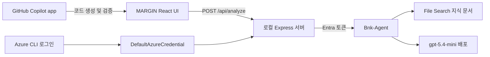

# MARGIN: GitHub Copilot app x Microsoft Foundry 핸즈온

Microsoft Foundry Prompt Agent와 독립형 **GitHub Copilot app**을 사용해 교육용 정책자금 상담 웹앱 `MARGIN`을 만들고, 로컬에서 실제 Agent 분석 결과를 확인하는 참가자용 가이드입니다.

> [!IMPORTANT]
> 이 실습은 VS Code의 GitHub Copilot 확장을 사용하지 않습니다. 별도로 설치하는 [GitHub Copilot app](https://github.com/features/ai/github-app)에서 진행합니다.

## 완성 결과

- Microsoft Foundry 프로젝트, 모델과 `Bnk-Agent` Prompt Agent
- File Search에 연결된 실제 정책, 규정과 업황 문서 기반 분석
- React 19, TypeScript, Vite와 Express 기반 `MARGIN` 웹앱
- Azure CLI와 Microsoft Entra 인증 기반 Foundry 연결
- 로컬 브라우저에서 정책자금 추천, 근거와 문서 초안 확인

## 진행 순서

| 순서 | 실습 | 완료 기준 |
| --- | --- | --- |
| 1 | [사전 준비 점검](docs/00-prerequisites.md) | 계정, 도구, 로그인을 확인하고 저장소를 준비합니다. |
| 2 | [Foundry 프로젝트, 모델, 에이전트 생성](docs/01-foundry.md) | `Bnk-Agent`와 File Search를 준비합니다. |
| 3 | [플레이그라운드에서 Agent 응답 테스트](docs/02-playground.md) | 응답 계약과 안전 경계를 확인한 뒤 연결 정보를 복사합니다. |
| 4 | [GitHub Copilot app으로 MARGIN 개발](docs/03-copilot-app.md) | Autopilot에서 전체 바이브 코딩 프롬프트로 앱을 구현하고 검증합니다. |
| 5 | [로컬에서 실제 Foundry Agent 확인](docs/04-local-run.md) | 교육용 예시 자동 채우기로 live 분석과 지식 근거를 확인합니다. |

막힌 경우 [문제 해결](docs/05-troubleshooting.md)에서 증상별 복구 절차를 확인하세요.

## 바로 시작하기

1. 이 저장소를 Fork하거나 로컬 폴더에 Clone합니다.
2. GitHub Copilot app에서 **Sessions** 옆의 **+**를 선택합니다.
3. **Local folder or repository**에서 이 저장소를 선택합니다.
4. [사전 준비 점검](docs/00-prerequisites.md)부터 순서대로 진행합니다.

> [!NOTE]
> 이 저장소에는 완성된 앱 소스가 없습니다. 참가자가 GitHub Copilot app과 함께 앱을 처음부터 생성합니다.

## 목표 구성

브라우저는 같은 origin의 `/api/health`와 `/api/analyze`만 호출합니다. 로컬 Express 서버가 Azure CLI 로그인 정보를 통해 Foundry를 호출하고, Agent 응답을 Zod 계약으로 검증한 뒤 live 결과만 UI에 전달합니다.

> [!IMPORTANT]
> MARGIN에는 교육용 합성 고객정보만 입력합니다. 실제 개인정보, 계좌정보와 운영 상품 조건은 사용하지 않습니다. 모든 추천과 문서는 담당자 검토 전 초안입니다.

> [!NOTE]
> 실제 지식 문서는 저장소에 포함하지 않습니다. 참가자가 Foundry의 `Bnk-Agent` File Search에 강사가 제공했거나 사용 승인을 받은 문서를 직접 연결해야 합니다.

## 저장소 구조

| 경로 | 내용 |
| --- | --- |
| `docs/` | 참가자 가이드와 문제 해결 |
| `prompts/` | Foundry 지침과 Copilot 앱 프롬프트 |

React 앱, Express 서버, 테스트와 Node.js 패키지 파일은 앱 개발 단계에서 생성합니다.

## 참고 자료

- [AzureAIWorkshop](https://github.com/Anna-Jeong-MS/AzureAIWorkshop)
- [CopoilotWorkshop-VSCode-Changju-Custom](https://github.com/ChangJu-Ahn/CopoilotWorkshop-VSCode-Changju-Custom)
- [GitHub Copilot app 시작하기](https://docs.github.com/en/copilot/how-tos/github-copilot-app/getting-started)
- [Microsoft Foundry 리소스 구성](https://learn.microsoft.com/azure/foundry/tutorials/quickstart-create-foundry-resources)
- [Microsoft Foundry SDK와 Prompt Agent](https://learn.microsoft.com/azure/foundry/quickstarts/get-started-code)
