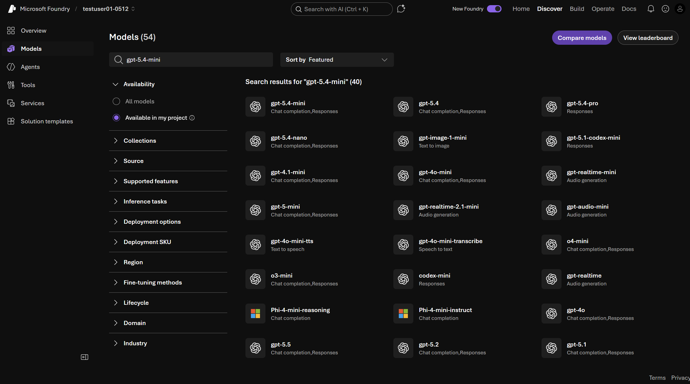
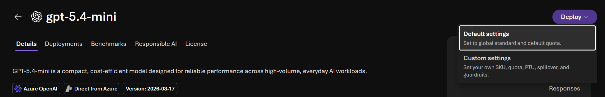
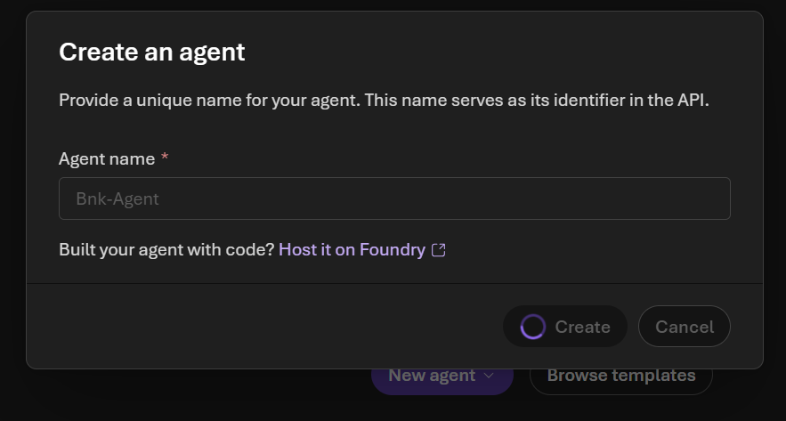
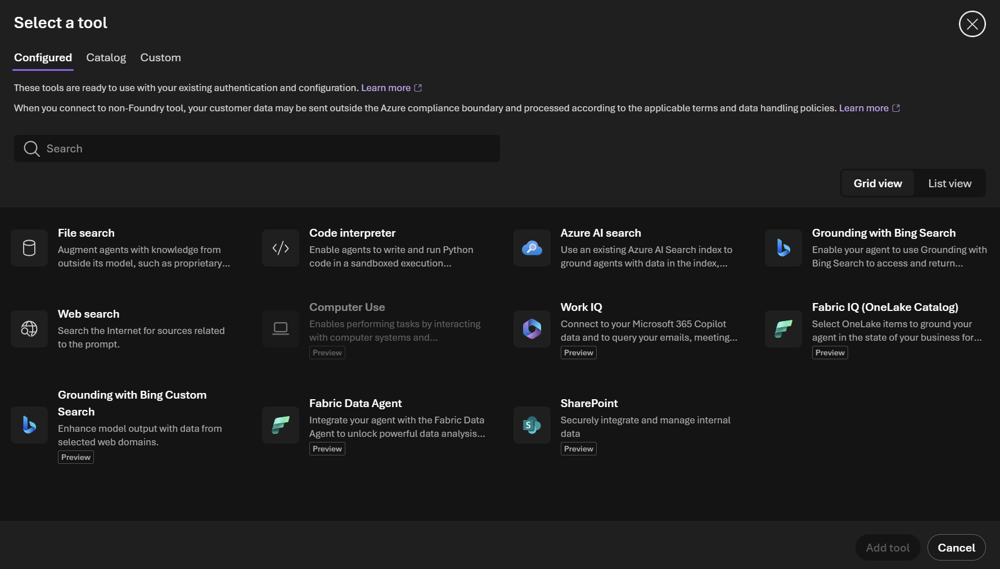
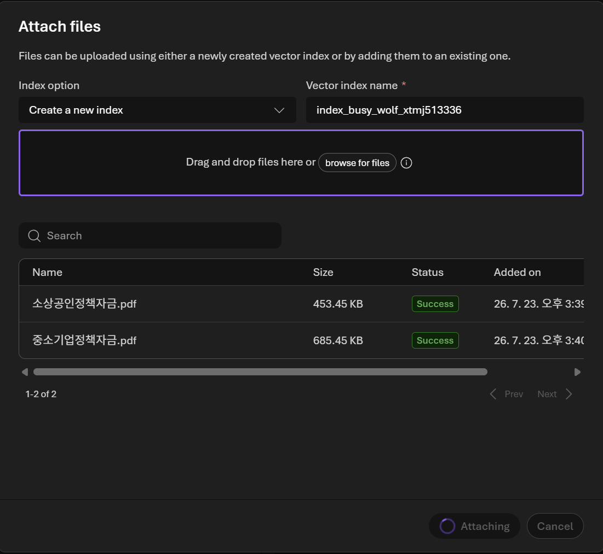

# Foundry 프로젝트, 모델, 에이전트 생성

[이전: 사전 준비](00-prerequisites.md) | [처음으로](../README.md) | [다음: 플레이그라운드 테스트](02-playground.md)

## 이름 정하기

리소스 이름 충돌을 피하기 위해 본인의 영문 별칭을 사용합니다.

| 항목 | 예시 |
| --- | --- |
| 리소스 그룹 | `rg-foundry-kim` |
| 프로젝트 | `foundry-workshop-kim` |
| 에이전트 | `Bnk-Agent` |

에이전트 이름은 앱 설정과 일치하도록 `Bnk-Agent`를 그대로 사용합니다.

## 프로젝트 만들기

1. [Microsoft Foundry](https://ai.azure.com/)에 로그인합니다.
2. 화면의 **New Foundry** 토글이 켜져 있는지 확인합니다.
3. 왼쪽 위 프로젝트 이름을 선택하고 **Create new project**를 선택합니다.
4. 프로젝트 이름을 입력합니다.
5. **Create project**를 선택합니다.

## 모델 배포하기

1. 오른쪽 위에서 **Discover**를 선택합니다.
2. 왼쪽 메뉴에서 **Models**를 선택합니다.
3. `gpt-5.4-mini`를 검색하고 모델을 선택합니다.

	

4. **Deploy** > **Default settings**를 선택합니다.

	

5. 배포 이름을 기록합니다.

해당 모델을 사용할 수 없다면 강사가 지정한 소형 채팅 모델을 선택합니다. 앱은 모델 이름을 직접 호출하지 않고 Prompt Agent를 호출하므로, 에이전트에 지원 모델이 연결되어 있으면 됩니다.

## Prompt Agent 만들기

1. 오른쪽 위에서 **Build**를 선택합니다.
2. 왼쪽 메뉴에서 **Agents**를 선택합니다.
3. **New agent**를 선택합니다.
4. 이름에 `Bnk-Agent`를 입력합니다.

	

5. 앞에서 배포한 모델을 선택합니다.
6. [Bnk-Agent 지침](../prompts/agent-instructions.md)의 코드 블록을 **Instructions**에 붙여 넣습니다.
7. 변경 사항을 저장하고 에이전트 버전이 생성되었는지 확인합니다.

포털 업데이트에 따라 **Save**, **Create version**, **Save as agent** 중 하나가 보일 수 있습니다. 최종 확인 항목은 이름이 `Bnk-Agent`이고 Instructions와 모델이 저장된 에이전트 버전이 존재하는지입니다.

## 실제 지식 문서 연결하기

MARGIN은 연결된 지식 문서에 근거한 추천만 표시합니다. 가짜 정책 문서나 고정 응답 파일은 만들지 않습니다.

1. `Bnk-Agent`의 **Tools**에서 **File Search**를 추가합니다.

	

2. 제공된 정책, 규정과 업황 문서를 연결합니다.
3. 문서 인덱싱이 완료됐는지 확인합니다.

	

4. Agent 버전을 다시 저장합니다.

연결할 문서가 없다면 Agent는 정책명과 수치를 추측하지 않고 추천 근거가 부족하다고 응답해야 합니다. 실제 개인정보와 내부 비공개 문서는 이 실습에 업로드하지 않습니다.

## 완료 확인

- [ ] New Foundry 프로젝트가 열립니다.
- [ ] 채팅 모델 배포가 `Succeeded` 상태입니다.
- [ ] `Bnk-Agent` Prompt Agent와 버전이 보입니다.
- [ ] File Search에 승인된 실제 지식 문서를 연결했습니다.

[다음: 플레이그라운드에서 Agent 응답 테스트](02-playground.md)