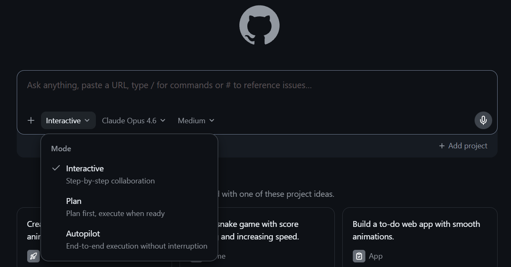

# GitHub Copilot app으로 MARGIN 개발

[이전: 플레이그라운드 테스트](02-playground.md) | [처음으로](../README.md) | [다음: 로컬 Foundry 확인](04-local-run.md)

## 저장소 연결

1. [GitHub Copilot app](https://github.com/features/ai/github-app)을 실행하고 GitHub 계정으로 로그인합니다.
2. 왼쪽 **Sessions** 옆의 **+** 를 선택합니다.
3. **Start session in**에서 이 저장소를 선택합니다.
4. 저장소가 없다면 **Add project from**에서 **Local folder or repository** 또는 **GitHub repository**를 선택합니다.
5. 프롬프트 아래의 실행 위치에서 **local repository**를 선택합니다.

`local repository`를 사용하면 로컬 Node.js와 Azure CLI 로그인 상태를 사용할 수 있습니다. `cloud sandbox`는 로컬 Azure 로그인 상태를 공유하지 않으므로 사용하지 않습니다.

## 구현 프롬프트 실행

1. 프롬프트 아래의 모드 메뉴에서 **Autopilot**을 선택하고 모델은 **Auto**로 설정합니다.

	

2. [MARGIN 바이브 코딩 프롬프트](../prompts/copilot-task.md)를 엽니다.
3. 문서의 코드 블록 전체를 복사해 프롬프트 입력창에 붙여 넣고 전송합니다.

Autopilot은 6개 이내의 계획을 제시한 뒤 구현, 테스트와 수정까지 중단 없이 계속해야 합니다. 설명만 하고 멈추면 다음과 같이 요청합니다.

```text
계획은 확인했다. 원래 프롬프트의 완료 기준까지 승인 대기 없이 구현과 검증을 계속해.
```

Autopilot이 권한이나 명령 실행 승인을 요청하면 명령과 작업 폴더를 확인한 뒤 승인합니다. 다음 명령은 이 저장소에서 정상적인 검증 명령입니다.

```text
npm run lint
npm run typecheck
npm test
npm run build
npm run test:e2e
npm run dev:full
```

토큰 출력, `.env` 커밋, 저장소 바깥 파일 수정, 광범위한 삭제를 요청하는 명령은 승인하지 않습니다.

## 변경 검토

1. 프롬프트 위의 **Changes**를 선택합니다.
2. 추가된 파일과 diff를 확인합니다.
3. `.env`, 토큰, 고객정보와 Agent 응답이 변경 파일에 포함되지 않았는지 확인합니다.
4. lint, typecheck, 단위 테스트, build와 E2E 결과를 확인합니다.

앞 단계에서 준비한 `.env`를 앱이 변경하거나 Git에 포함하지 않았는지 확인합니다. 브라우저에서 [http://localhost:3000](http://localhost:3000)을 열어 다음 구현 상태만 확인합니다.

- 첫 화면의 고객정보 폼은 비어 있습니다.
- MARGIN React 화면과 3단계 진행 상태가 렌더링됩니다.
- 연결 상태가 **연결 준비 완료**로 표시됩니다.
- 실제 개인정보를 입력하지 말라는 안내가 항상 보입니다.
- 390px 모바일에서도 입력과 버튼을 사용할 수 있습니다.

## 변경 보관

Fork를 사용 중이면 **Create PR**을 선택해 변경 내용을 Pull Request로 만들 수 있습니다. 로컬 변경만 유지하려면 Git 상태를 확인하고 직접 커밋합니다.

```powershell
git status --short
git diff
```

`.env`와 고객 입력 또는 Agent 응답 데이터가 변경 목록에 나타나지 않아야 합니다.

## 구현이 완료되지 않은 경우

같은 세션에서 실패한 명령과 오류 메시지를 Copilot에 전달하고 수정하도록 요청합니다. 모든 검증과 `npm run dev:full` 실행이 성공한 뒤 로컬 Foundry 확인 단계로 이동합니다.

## 완료 확인

- [ ] GitHub Copilot app의 로컬 저장소 세션을 사용했습니다.
- [ ] MARGIN 전체 구현 프롬프트를 Autopilot 모드에 제출했습니다.
- [ ] **Changes**에서 diff를 직접 확인했습니다.
- [ ] `.env`와 토큰이 변경 내용에 포함되지 않았습니다.
- [ ] lint, typecheck, 단위 테스트, build와 E2E가 통과합니다.
- [ ] [http://localhost:3000](http://localhost:3000)에서 MARGIN React 화면과 연결 상태를 확인했습니다.

[다음: 로컬에서 실제 Foundry Agent 확인](04-local-run.md)